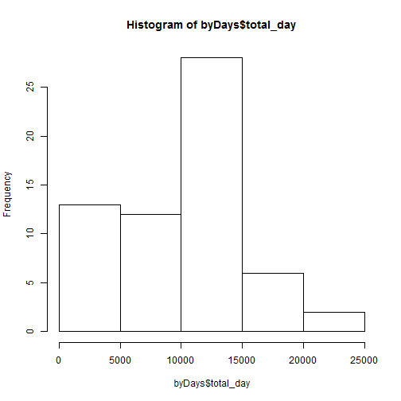
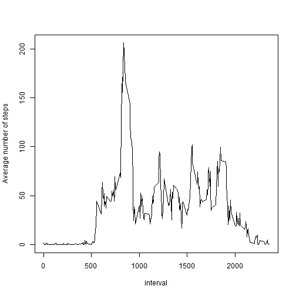
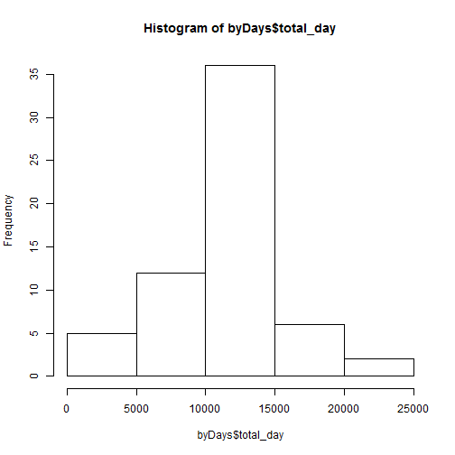
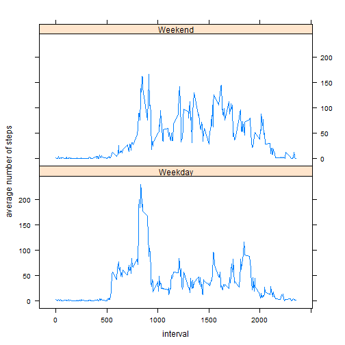

## Loading and preprocessing the data

Welcome to my first ever knit document! Please don't mind me while I clean the data a bit. Why not imagine it's actually a cute kitten?

```r
library(dplyr)
if (!any(list.files()=="activity.csv")) unzip("activity.zip")
data<-read.csv("activity.csv", stringsAsFactors=FALSE)
data$date<-as.Date(data$date)
```

There, all done. If a cluttered desk is a cluttered mind, what's an empty desk?

## What is mean total number of steps taken per day?

OK, here we go with the real stuff. This is so much fun!
First, a histogram of the number of steps taken each day!


```r
avgSteps<-summarise(group_by(data,interval),avg_steps=mean(steps,na.rm=T))
byDays<-summarise(group_by(data,date),total_day=sum(steps,na.rm=T))
hist(byDays$total_day)
```

 

That's quite impressive!

Maybe the mean and medial will tell a different story.


```r
print(paste("Mean: ",mean(byDays$total_day, na.rm=TRUE)))
```

```
## [1] "Mean:  9354.22950819672"
```

```r
print(paste("Median: ",median(byDays$total_day, na.rm=T)))
```

```
## [1] "Median:  10395"
```

Yeah, that's more reasonable.

## What is the average daily activity pattern?

OK, maybe there's a lot of sedentry time interspaced with energetic walks! Let's check it out!


```r
with(avgSteps,plot(interval,avg_steps,type="l",ylab="Average number of steps"))
```

 

```r
print(paste("Max average steps: ",max(avgSteps$avg_steps)))
```

```
## [1] "Max average steps:  206.169811320755"
```

Well, that looks a bit better, doesn't it? I mean, there's a lot of sleeping going on, at least. But this person might actually be walking to work everyday! (though, oddly, not walking back. Or maybe she or he just come home at a different time every day... hmm...)

Where was I?

## Imputing missing values

Wait a minute! This lazy bum doesn't have data on all days! That's terrible!


```r
print(paste("Number of missing values: ",sum(is.na(data))))
```

```
## [1] "Number of missing values:  2304"
```

Oh god oh god oh god, what am I going to do?! I know! I'll fill it up with fake data! Yeah!
I'm going to use the average for each interval across days, and add or subtract from it the difference between that day's average and the general average, so that if this is a particularly lazy day, they get fewer steps for the missing values. (unless there's no data for that day, in which case they get just the average for that interval). That'll show 'em!


```r
avgDays<-summarise(group_by(data,date),avg_day=mean(steps,na.rm=T))
AvgAll<-mean(data$steps,na.rm=T)
data2<-data
data2$steps[is.na(data2$steps)]<-avgSteps$avg_steps[avgSteps$interval %in% data2$interval[is.na(data2$steps)]]+avgDays$avg_day[avgDays$date %in% data2$date[is.na(data2$steps)]]-AvgAll
data2$steps[is.na(data2$steps)]<-avgSteps$avg_steps[avgSteps$interval %in% data2$interval[is.na(data2$steps)]]
```

Man, that's some ugly code. Oh well, at least it works, eh? Now let's do those histogram, mean and media again.


```r
byDays<-summarise(group_by(data2,date),total_day=sum(steps,na.rm=T))
hist(byDays$total_day)
```

 

```r
print(paste("Mean: ",mean(byDays$total_day, na.rm=TRUE)))
```

```
## [1] "Mean:  10766.1886792453"
```

```r
print(paste("Median: ",median(byDays$total_day, na.rm=T)))
```

```
## [1] "Median:  10766.1886792453"
```

Not much different, is it? Although it now seems less skewed. Notice that the mean and median are now equal! Perfect normal distribution! Woot! Those days in the exact middle are an artefact of the method I used - they are days that have the average number of steps, because there was no other info to work with.

## Are there differences in activity patterns between weekdays and weekends?

OK, let's check to see if there's a difference between the weekend and the rest of the week.


```r
weekdays<-c("Monday","Tuesday","Wednesday","Thursday","Friday")
weekends<-c("Saturday","Sunday")
wd[which(weekdays(data2$date) %in% weekdays)]<-"Weekday"
wd[which(weekdays(data2$date) %in% weekends)]<-"Weekend"
data2$weekday<-as.factor(wd)
byWeekdays<-summarise(group_by(data2,weekday,interval),avgdaytype=mean(steps))
xyplot(avgdaytype ~ interval | weekday, data=byWeekdays,type="l",layout=c(1,2),ylab="average number of steps")
```

 

Bd-bd-bd-b-that's all, folks!
